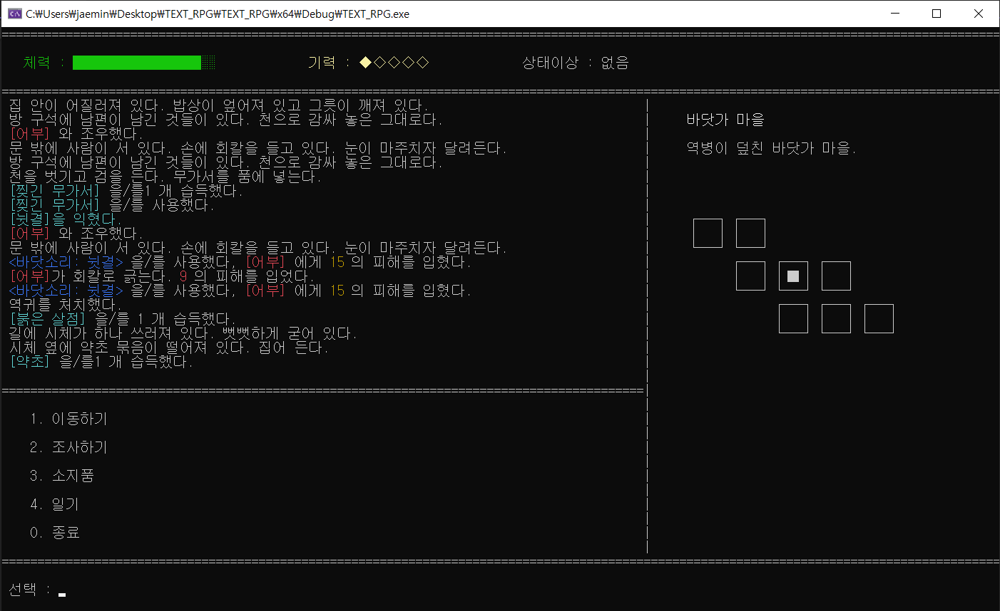
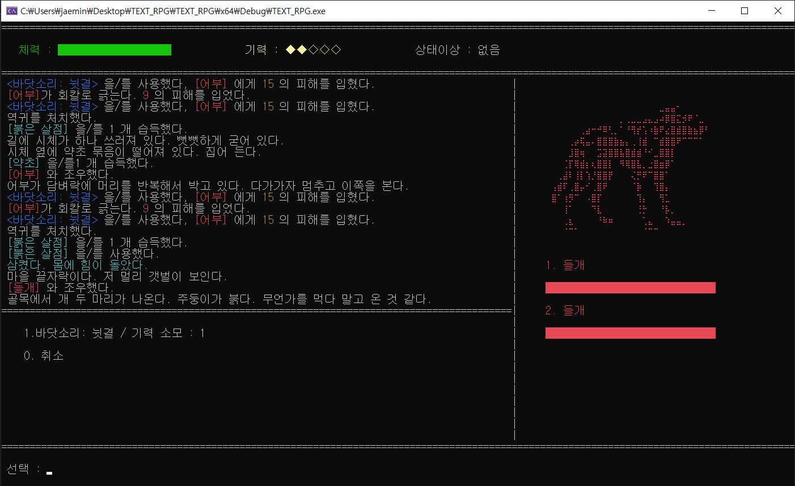
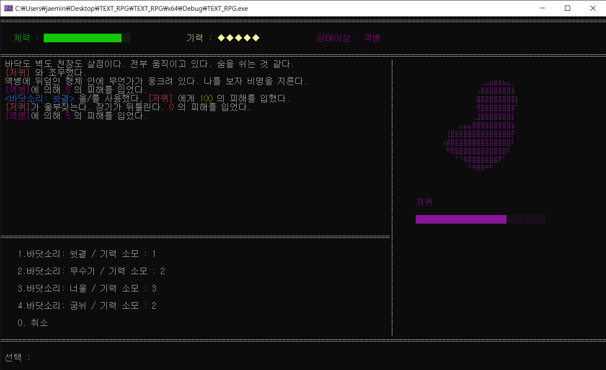

# 섬그늘

처용가와 섬집아기를 모티프로 한 한국 중세 다크 판타지 텍스트 RPG

> 남편이 돌아오지 않은 지 3년.
> 바다가 붉게 물들고 역병이 마을에 닿는다.
> 아이를 지키기 위해, 아내는 남편이 남긴 검과 무가서를 들고 집을 나선다.

---

## 스크린샷

| 탐색 | 전투 | 보스전 |
|:---:|:---:|:---:|
|  |  |  |

---

## 기술 스택

| 항목 | 내용 |
|---|---|
| 언어 | C++17 |
| 개발 환경 | Visual Studio 2022 |
| 외부 라이브러리 | nlohmann/json (JSON 파싱), Windows MCI (사운드) |
| 버전 관리 | Git / GitHub |

---

## 실행 방법

1. Visual Studio 2022에서 `TEXT_RPG.sln` 열기
2. x64 / Debug 구성 선택
3. 빌드 후 실행 (F5)

> 콘솔 크기가 자동 설정됩니다 (140 x 41)

---

## 설계 패턴 및 아키텍처

### Stack-based FSM (유한 상태 머신)
게임 흐름을 State 스택으로 관리합니다. pushState/popState/changeState로 상태를 전환하며, 이전 상태로의 복귀가 자연스럽습니다.
```
TitleState → PageState(프롤로그) → ExploreState ⇄ CombatState
                                                      ↓
                                                 GameOverState
```

### Command Pattern (전투 시스템)
플레이어 스킬과 몬스터 공격을 Command 객체로 캡슐화하여 동일 인터페이스로 실행합니다.
```
PlayerCommand (abstract)
├── SkillCommand → NuigyeolCommand, MusukiCommand, NeoulCommand, ...
├── DefendCommand
└── FleeCommand

MonsterCommand (abstract)
└── MonsterAtkCommand (Effect별 분기: Poison, HpAbsorb, HpRegen, ...)
```

### Factory Pattern
- **MonsterFactory** — JSON 데이터 기반으로 Monster/Boss 객체 생성
- **SkillCommandFactory** — SkillType enum → 구체 Command 객체 생성

### Data-Driven Design
모든 게임 콘텐츠(몬스터, 아이템, 맵, 스킬, 스토리)를 JSON으로 분리했습니다. 코드 수정 없이 데이터만으로 콘텐츠 추가/수정이 가능합니다.

### Entity 상속 구조
```
IDamageable (interface)
    └── Entity (abstract)
          ├── Player
          └── Monster
                └── Boss (Template Method: 페이즈 전환)
                      ├── JeokkwiBoss (최종 보스)
                      └── JeokgapsinBoss (중간 보스)
```

### Template Method Pattern (Boss 페이즈 전환)
Boss 클래스가 HP 50% 이하 시 페이즈 전환 로직의 뼈대를 정의하고, 각 보스 서브클래스가 전환 연출을 구현합니다.

---

## 프로젝트 구조

```
TEXT_RPG/
├── src/
│   ├── core/          GameManager, FSM States (Explore, Combat, Page, ...)
│   ├── entity/        Entity, Player, Monster, Boss
│   ├── combat/        CombatSystem, Command 패턴, 스킬 구현체
│   ├── data/          DataManager, JSON 데이터 타입 정의
│   ├── map/           Map (6x6 그리드), Room, Direction
│   ├── save/          SaveManager (JSON 직렬화)
│   ├── inven/         InventoryHandler (탐험/전투 공용)
│   ├── input/         InputHandler
│   ├── sound/         SoundManager (Windows MCI)
│   └── ui/            UIRenderer (콘솔 레이아웃, 미니맵, 로그)
├── data/              게임 데이터 (monsters, items, skills, maps, story)
├── bgm/               배경 음악
├── saves/             세이브 파일
└── docs/              GDD (Game Design Document)
```

---

## 개발 기록

- [벨로그 시리즈](https://velog.io/@rhwk341/series/Portfolio)

---

## 라이선스

이 프로젝트는 개인 포트폴리오 목적으로 제작되었습니다.
